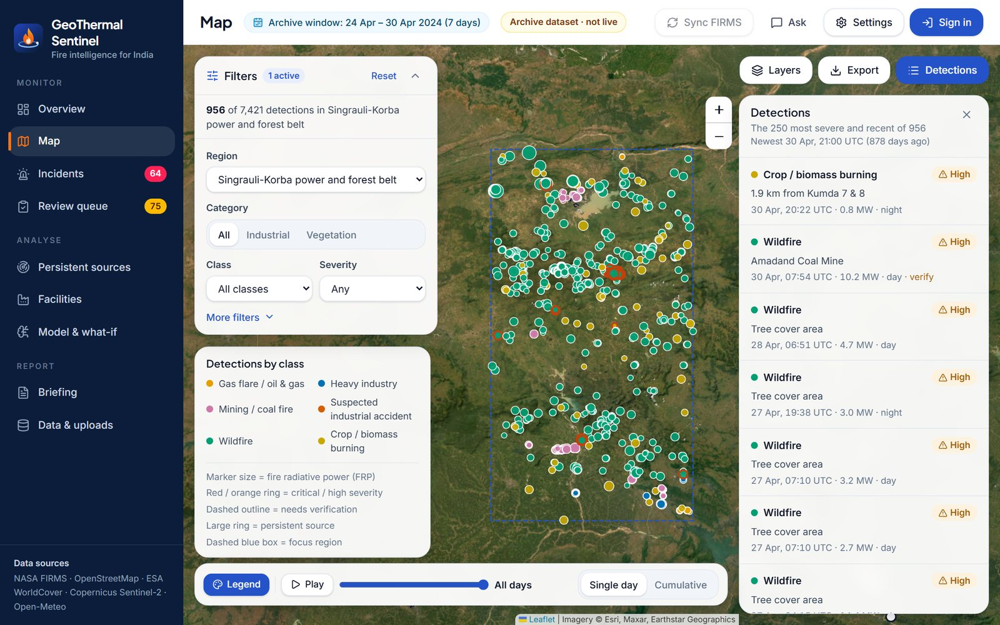
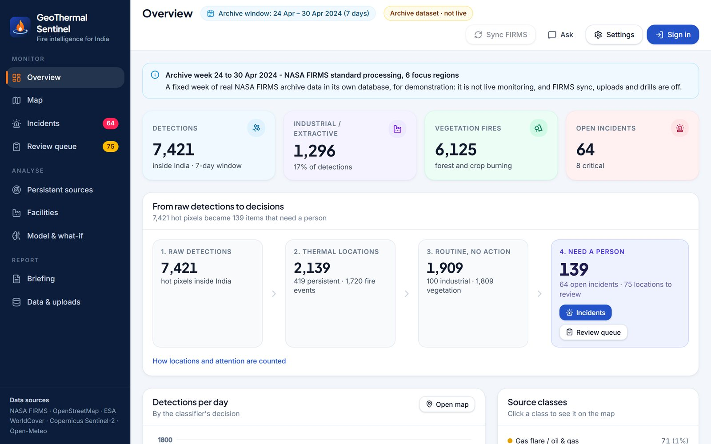
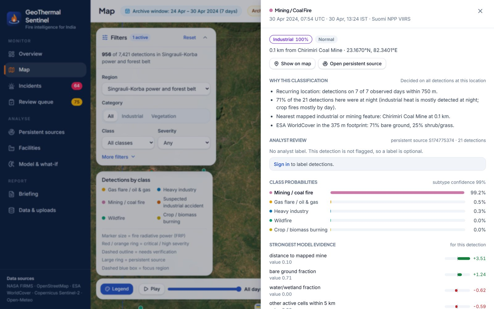
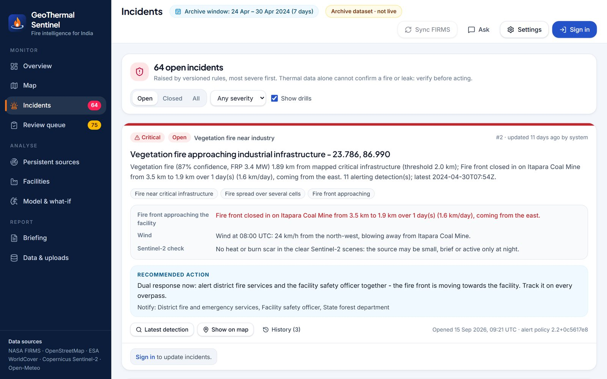
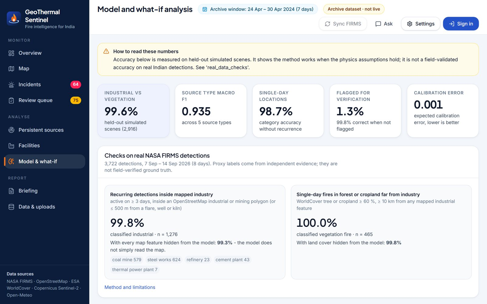
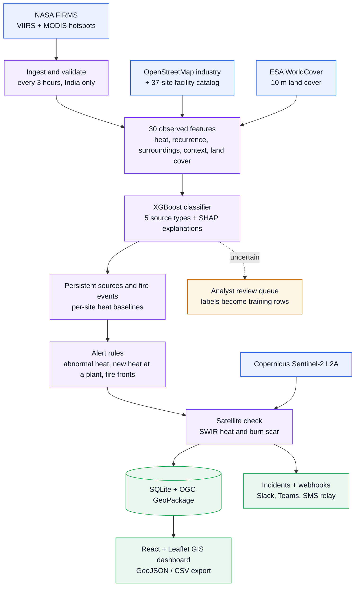

<div align="center">


# GeoThermal Sentinel

**AI + GIS intelligence for industrial fires and persistent thermal sources across India**

[](#team)
[](#problem-statement-and-how-it-is-met)
[](backend/requirements.txt)
[](backend/app/main.py)
[](frontend/package.json)
[](backend/ml/train.py)
[](frontend/src/components/MapView.tsx)
[](backend/tests)

Smart India Hackathon 2026 · Problem Statement **SIH26162** (NTRO) · Team **SIT_Nexora** (Team ID 176133)

</div>



NASA FIRMS reports **where** it is hot, not **what** is burning: a refinery flare, a steel plant, a coal-seam fire, stubble
burning and a forest fire all arrive as the same kind of hot pixel. **GeoThermal Sentinel** turns every FIRMS detection over
India into a classified, explained and verified alert on a GIS map. It fuses NASA FIRMS with OpenStreetMap industry,
ESA WorldCover land cover and Copernicus Sentinel-2 imagery, classifies each hotspot with XGBoost, remembers every site's
normal heat and raises an alert only when something is abnormal.

Two real datasets are bundled: the live near-real-time week (7–14 Sep 2026, monsoon) and an archive week from the fire
season (24–30 Apr 2024), which shows crop and forest fires next to industry.

## Contents

- [Highlights](#highlights)
- [Problem statement and how it is met](#problem-statement-and-how-it-is-met)
- [Screenshots](#screenshots)
- [Architecture](#architecture)
- [Getting started](#getting-started)
- [How a detection is classified](#how-a-detection-is-classified)
- [Evaluation](#evaluation)
- [From raw detections to decisions](#from-raw-detections-to-decisions)
- [Analyst review and training labels](#analyst-review-and-training-labels)
- [Focus regions and the archive week](#focus-regions-and-the-archive-week)
- [GIS layer store and exports](#gis-layer-store-and-exports)
- [Alerts, notifications and audit](#alerts-notifications-and-audit)
- [Data sources: what is real, and what is not](#data-sources-what-is-real-and-what-is-not)
- [Project layout](#project-layout)
- [Limitations](#limitations)
- [Team](#team)
- [Attribution](#attribution)

## Highlights

| Highlight | What it means |
| --- | --- |
| **3,722 → 96** | FIRMS hotspots in one live week became 96 locations that need a person (2.6 %) |
| **5 source types** | gas flare / oil & gas, heavy industry, mining / coal fire, wildfire, crop burning, from 30 observed features |
| **99.3 %** | of recurring industrial heat on real FIRMS data still recognised with every map feature removed |
| **11,143** | real NASA FIRMS detections analysed across a monsoon week and a fire-season week |
| **Site baselines** | each persistent source is judged against its own heat history, so routine flares stay quiet |
| **Fire-front tracking** | measures whether a vegetation fire is closing in on a refinery, power plant or mine |
| **Sentinel-2 check** | SWIR heat and burn-scar tests confirm or question each incident, never override it |
| **GIS ready** | OGC GeoPackage layer store for QGIS / ArcGIS, GeoJSON and CSV exports, live web map |
| **83 tests** | automated tests for validation, features, alert policy, GIS store, API and permissions |

## Problem statement and how it is met

**SIH26162 – AI-Based Detection and Classification of Industrial Fires and Persistent Thermal Sources Using NASA FIRMS,
OSM & Satellite Data** · National Technical Research Organisation (NTRO) · Theme: Disaster Management · Category: Software

| Requirement | How it is met |
| --- | --- |
| (i) Classification and segregation of industrial fires from forest and other natural fires | Every FIRMS detection is classified as industrial/extractive or vegetation fire, with a source type (gas flare / oil & gas, heavy industry, mining / coal fire, wildfire, agricultural burning). FRP far above a source's own history raises a *suspected industrial fire/explosion* alert; sudden heat at a plant with no history raises a *possible fire or emergency flaring* alert. Results with mixed evidence go to an analyst review queue. |
| (ii) GIS-based data storage and map overlays | Every analysis is stored in SQLite and written to an OGC **GeoPackage** layer store (detections, persistent sources, incidents, facility boundaries, OSM industrial features, India boundary) that opens in QGIS or ArcGIS; layers download as GeoJSON and detections as CSV. The web map overlays detections, persistent sources, facility outlines and OSM features on street, Esri satellite or NASA GIBS imagery, with a day-by-day timeline and focus regions. |
| Integrate thermal data, land cover, industrial databases and satellite imagery | NASA FIRMS VIIRS and MODIS detections; ESA WorldCover fractions as model features; OpenStreetMap industry plus a 37-site facility catalog; Sentinel-2 shortwave-infrared checks for heat and burn scars on every open incident; Open-Meteo wind at fires near plants. |
| Monitor industrial fires and persistent thermal sources | FIRMS is polled every 3 hours; locations active on several days become persistent sources with FRP baselines and trends. Alerts carry reason codes and a versioned alert policy, measure whether a fire front is approaching a plant, and become incidents with a triage workflow, webhook notifications (Slack, Teams, SMS / email relay) and an audit log. |

## Screenshots

| Overview: from raw detections to decisions | Detection detail: why this classification |
| --- | --- |
|  |  |
| **Incidents: a fire front approaching a coal mine** | **Model: accuracy and checks on real FIRMS data** |
|  |  |

Screenshots show the bundled archive week (24–30 Apr 2024).

## Architecture



| Layer | Technologies |
| --- | --- |
| Backend | Python, FastAPI, Uvicorn, SQLAlchemy + SQLite, APScheduler, PyJWT |
| AI / ML | XGBoost, scikit-learn (DBSCAN, BallTree, GroupKFold), TreeSHAP, NumPy, pandas, physics-based simulator |
| Geospatial | Shapely, OGC GeoPackage, GeoJSON, NASA GIBS, Esri imagery |
| Frontend | React 19, TypeScript, Vite, Tailwind CSS 4, Leaflet, Recharts |

## Getting started

**Prerequisites:** Python 3.10+ (tested with 3.14) and internet access for live data. Node.js 20.19+ or 22.12+ is only needed to change
the frontend: the backend serves the prebuilt dashboard from `frontend/dist`.

```bash
git clone https://github.com/dhruv-197/SIH2026.git
cd SIH2026
python -m pip install -r backend/requirements.txt
```

On Windows, `py` works in place of `python`. `backend/requirements-lock.txt` lists the exact versions the project was
tested with.

**Live dashboard** (NASA FIRMS polled every 3 hours) – http://127.0.0.1:8000, API docs at http://127.0.0.1:8000/docs

```bash
cd backend
python -m uvicorn app.main:app --host 127.0.0.1 --port 8000
```

Windows: double-click `run_backend.bat`.

**Archive week** (fire season, 24–30 Apr 2024, fixed dataset) – http://127.0.0.1:8001. It can run next to the live server.

```bash
cd backend
GEOTHERMAL_DB_PATH=app/data/archive/2024-04-24/geothermal.db GEOTHERMAL_STATIC_DATASET=1 \
GEOTHERMAL_DATASET_LABEL="Archive week 24 to 30 Apr 2024" \
python -m uvicorn app.main:app --host 127.0.0.1 --port 8001
```

Windows: double-click `run_archive_demo.bat`.

**Frontend development** (hot reload, API proxied to port 8000) – http://localhost:5173

```bash
cd frontend
npm install
npm run dev
```

`start_all.bat` starts backend and frontend together on Windows. Rebuild the served dashboard with `npm run build`.

**Tests**

```bash
python -m pytest backend/tests
```

Notes:

- On an empty database the API loads the bundled FIRMS snapshot, fetches WorldCover land cover for every detection
  location (a few minutes), runs the analysis and checks the resulting incidents against Sentinel-2. The scheduler
  then polls FIRMS every 3 hours.
- An open dashboard checks the API every minute and reloads its data after each sync, re-analysis or analyst label; if
  the API cannot be reached, it keeps the last data on screen and says so.
- Viewing is open. Actions need a role: **analyst** (sync data, upload CSV, triage incidents, label detections, read the
  audit log) or **commander** (also settings, drills, test notifications). Demo passwords are `analyst-demo` /
  `commander-demo`; set `ANALYST_PASSWORD`, `COMMANDER_PASSWORD` and `JWT_SECRET_KEY` for any real deployment.

### Configuration

| Variable | Purpose |
| --- | --- |
| `NASA_FIRMS_MAP_KEY` | Optional FIRMS MAP_KEY (can also be saved in Settings) |
| `JWT_SECRET_KEY` | Signing key for sessions; without it sessions end when the server restarts |
| `ANALYST_PASSWORD`, `COMMANDER_PASSWORD` | Replace the demo passwords |
| `CORS_ORIGINS` | Comma-separated allowed browser origins (default localhost:5173) |
| `GEOTHERMAL_DB_PATH` | SQLite file location |
| `GEOTHERMAL_GIS_STORE_PATH` | GeoPackage layer store (default `gis/geothermal_sentinel.gpkg` next to the database) |
| `GEOTHERMAL_FRONTEND_DIST` | Built dashboard served by the API (default `frontend/dist`) |
| `GEOTHERMAL_OFFLINE=1` | No outbound network calls (land cover, imagery, wind and notifications report "unavailable") |
| `GEOTHERMAL_STATIC_DATASET=1` | Serve a fixed dataset such as the archive week: no bootstrap, FIRMS polling, sync or upload |
| `GEOTHERMAL_DATASET_LABEL` | Name of that dataset, shown as a banner in the dashboard |
| `GEOTHERMAL_RETENTION_DAYS` | Initial retention window (default 45 days) |

### Rebuilding data and the model

```bash
py backend/scripts/fetch_osm_industrial.py        # OpenStreetMap industrial extract (Overpass)
py backend/scripts/prepare_india_boundary.py      # India boundary from Natural Earth
py backend/scripts/match_catalog_to_osm.py        # match catalog facilities to OSM geometry
py backend/ml/train.py                            # simulate, cross-validate and train the classifier
py backend/scripts/build_dataset.py --source public-7d   # fresh 7-day FIRMS download + land cover + analysis
py backend/ml/evaluate_real.py                    # real-data checks into the evaluation report
py backend/scripts/build_archive_dataset.py --csv viirs-snpp_2024_India.csv --csv modis_2024_India.csv --start 2024-04-24
py backend/ml/evaluate_real.py --db backend/app/data/archive/2024-04-24/geothermal.db --key archive_data_checks
```

Stop the API server before `build_dataset.py` (it recreates the database). The yearly country files for the archive week
come from https://firms.modaps.eosdis.nasa.gov/country/ (`--count` prints detections per day and region to choose a week).

## How a detection is classified

1. **Ingest and validate.** FIRMS CSV rows are parsed (VIIRS or MODIS columns), rejected with a reason if a required
   value is missing or impossible, de-duplicated and kept only inside India.
2. **Measure 30 features from observations only** (`backend/app/pipeline/features.py`):
   - radiometry: FRP, MIR/TIR brightness temperatures and their difference, saturation, day/night, sensor, pixel size;
   - recurrence: distinct days with detections within 750 m across the observation window, night share, FRP stability;
   - surrounding activity: simultaneous detections within 2 km, active cells and day-to-day movement within 5 km;
   - context: distance to OSM oil & gas, heavy industry and mining features, containment in an industrial polygon;
   - land cover: WorldCover tree, shrub/grass, cropland, built-up, bare and water fractions.
   Training and live classification call the same function, and nothing in an input record can override a feature.
3. **Classify.** A gradient-boosted tree model (XGBoost) outputs probabilities for five source types. The
   industrial-versus-vegetation decision uses the summed probabilities; the subtype is picked inside that group.
4. **Group persistent sources.** Locations with detections on two or more separate days are clustered and classified
   on all their detections together.
5. **Assess severity** (`backend/app/pipeline/severity.py`, thresholds editable in Settings):
   - *Suspected industrial excursion (critical):* FRP ≥ 4 robust standard deviations above the source's own median,
     ≥ 2.5× its own 90th percentile and ≥ 10 MW above the median, with at least 6 prior detections on 3 days.
   - *Unusual heat at an industrial site (high):* industrial heat within 1 km of a mapped site with no history there -
     one detection of ≥ 50 MW, or a same-overpass cluster of new activity totalling ≥ 50 MW. This is a possible fire or
     emergency flaring, e.g. 9 pixels totalling 93 MW inside the Mangalore refinery on the night of 9 Sep 2026.
   - *Cross-alert (high):* a vegetation fire within 2 km of critical infrastructure (refineries, power plants, steel,
     cement, mines - brick kilns excluded) with FRP ≥ 5 MW, even when the classification is uncertain (the alert says
     so), or a fire spread over at least 3 cells that is classified with ≥ 75 % confidence. It becomes **critical when
     the fire front is approaching the facility** (`backend/app/pipeline/approach.py`): on the same side of the
     facility, the closest detection per day of one front - its fires within 3 km from day to day - closed in by at
     least 1 km at 0.5 km/day or more. Separate fires on different days are not treated as a moving front.
   - *High-intensity vegetation fire (high):* FRP ≥ 100 MW or ≥ 25 active cells within 5 km over 3 days.
   Every alert lists machine-readable **reason codes** (for example `ABN_BASELINE_EXCEEDED`, `NEW_HEAT_AT_SITE`,
   `FIRE_APPROACHING`) and the **alert policy version**: the rules version plus a fingerprint of the thresholds in force
   (`2.2+0c5617e8` for the defaults). Alerts become incidents grouped per persistent source or fire event;
   high-intensity vegetation fires are grouped per fire complex (alerting detections within 5 km), so one large forest
   fire raises one incident. When re-analysis (new data, model or thresholds) no longer raises an alert that nobody has
   acted on, the incident is withdrawn with a note in its history, and it is re-opened if the condition returns.
6. **Flag uncertainty.** A result is marked *needs verification* when category confidence is below 75 %, a single
   detection has no land cover, a vegetation fire lies inside a mapped industrial or mining site, single-day
   industrial heat is more than 2 km from any mapped industry, or satellite imagery contradicts the classification.
   Flagged locations go to the review queue (see *Analyst review*).
7. **Check against satellite imagery** (`backend/app/pipeline/imagery.py`). For every open incident, and on request for
   any detection, the Sentinel-2 L2A scenes from 30 days before to 20 days after the detection are measured over a
   ~780 m box, server-side on the Microsoft Planetary Computer:
   - *heat:* pixels with NHI_SWIR = (B12 − B11) / (B12 + B11) above 0.1 and B12 reflectance above 0.15 (after Marchese
     et al. 2019); heat on dates at least 4 days apart marks a persistent source;
   - *burn scar:* the normalized burn ratio (B8A − B12) / (B8A + B12) over clear land falls by 0.1 on average, or by
     0.2 in its darkest 5 % (Key & Benson 2006).
   A burn scar supports a vegetation fire, persistent heat without one supports an industrial source, both together
   are reported as mixed. The imagery never overrides the model; a contradicting finding flags the detection for
   verification. On the live week it found heat on three dates in the Hospet steel belt (an alert the classifier had
   called a vegetation fire), confirmed heat at Talcher and Mangalore, and - as expected for Sentinel-2's morning pass -
   saw nothing of the night-only flaring at Hazira. Open cross-alerts also record the wind at the overpass and whether
   it blows from the fire towards the facility.

Emission estimates are given only for vegetation fires (Wooster et al. 2005 combustion rate; Andreae & Merlet 2001
emission factors) and are instantaneous rates at the overpass.

## Evaluation

Full numbers are on the **Model and what-if** page and in `backend/ml/evaluation_report.json`.

**Held-out simulated scenes** (GroupKFold by scene, 299,466 detections, 2,916 scenes, 18 scenario families):

- Industrial vs vegetation accuracy 99.6 %; source-type accuracy 93.2 %, macro F1 0.935.
- Hard cases are reported separately. Industrial-versus-vegetation accuracy is lowest for a vegetation fire inside
  plant or mine premises (77 %), a flaring upset at an unmapped plant (81 %) and an accidental fire inside a mapped
  plant (85 %). The weakest source type is a gas flare versus a heavy plant at a site not mapped in OSM (58 %, while
  still 99.8 % correctly *industrial*).
- These numbers show the method works when the simulation's physics holds. **They are not a field-validated accuracy.**

**Checks on real FIRMS detections** (proxy labels from independent evidence, `ml/evaluate_real.py`):

| Check | Live week, 7–14 Sep 2026 | Archive week, 24–30 Apr 2024 |
| --- | --- | --- |
| Recurring (≥ 3 days) detections inside mapped OSM industrial/mining sites -> industrial | 99.8 % of 1,276 (99.3 % with all map features removed) | 100 % of 803 (99.9 % with all map features removed) |
| Single-day fires in ≥ 60 % forest or cropland, ≥ 10 km from mapped industry -> vegetation | 100 % of 465 (99.8 % with land cover removed) | 99.8 % of 3,518 (99.0 % with land cover removed) |
| NASA's static-source flag (type 2, other static land source) -> shown as industrial | - (not in near-real-time data) | 98.8 % of 1,084 |
| NASA's presumed vegetation fire (type 0) -> shown as vegetation | - | 96.5 % of 6,327 |

The ablations show the model relies on persistence and radiometry, not just on the map. Proxy labels are biased
towards clear-cut cases; they are evidence of consistency, not ground truth. NASA derives its flag from years of
recurrence, independently of our maps and land cover; industrial sources without a long record stay "presumed
vegetation" in it, so the last row mixes real disagreements with industrial heat NASA has not flagged.

**What the archive week changed.** Its first analysis (model 2.1.0) called 187 detections in the Uttarakhand forest
tile *mining / coal fire*: faint night-time pixels of spring forest fires. The simulator had kept vegetation fires at
daytime intensity at night (median FRP about 2.2 MW, against 1.0 MW for real VIIRS night pixels over those forests),
while its coal fires were fainter than real ones and sometimes sat under forest cover. Night-time fire behaviour and
the land cover under coal fires were recalibrated to the distributions of real detections (`ml/simulator.py`), and
model 2.2.0 was retrained on simulation alone - no real detection is a training label. Industrial labels in the
Uttarakhand tile fell from 191 to 43, while Singrauli-Korba and Talcher-Angul kept the same counts (303 and 284);
industrial labels more than 10 km from any mapped industry fell from 268 to 115, and agreement with NASA's
presumed-vegetation flag rose from 94.1 % to 96.5 %. An acceptance test built from 51 real detections of one of those
fires guards the case.

**Automated tests:** `python -m pytest backend/tests` (83 tests) - record validation, feature integrity (records cannot
inject features), same-overpass clustering, the verification policy, acceptance scenarios written by hand or taken from
the FIRMS archive (first detections of forest fires, night fires, faint night pixels of a real forest fire in the
Uttarakhand hills, crop burning, unmapped persistent flares, a steel plant with shifting hot spots, coal-fire fields, an
advancing wildfire near a power plant, a one-night flaring upset inside a refinery, a grass fire in a plant's green belt,
FRP excursions and new-activity alerts), reason codes and the alert policy version, the
fire-front direction (including separate fires on different days, modelled on a real week), the wind's relation to a
facility, fire-complex grouping, the attention funnel, GeoPackage structure and downloads, webhook payloads and
delivery, Sentinel-2 band maths and verdicts, the database migration, the FIRMS polling schedule, and end-to-end API tests including permissions, an archive server refusing sync, uploads and drills,
CSV validation and export, analyst reviews (append-only labels, the queue and the training export), the audit log, the
drill-to-incident flow, an approaching fire front raising a critical alert, and automatic withdrawal and re-opening of
alerts.

## From raw detections to decisions

The Overview counts how much of the satellite feed needs a person (`backend/app/pipeline/funnel.py`). A location is a
persistent source or a fire event (other detections within 3 km, no gap over 3 days); attention means an open
incident, or a location without an alert whose detections are flagged and not yet labelled.

| Dataset | FIRMS detections | Thermal locations | Classified, no action | Need a person |
| --- | --- | --- | --- | --- |
| Live week, 7–14 Sep 2026 | 3,722 | 1,025 (238 persistent sources, 787 fire events) | 930 | **96**: 12 open incidents, 84 locations to review |
| Archive week, 24–30 Apr 2024 | 7,421 | 2,139 (419 persistent sources, 1,720 fire events) | 1,909 | **139**: 64 open incidents, 75 locations to review |

Known flares, kilns and plants that stay within their own normal range raise no alert.

## Analyst review and training labels

Uncertain results go to the **Review queue** (most urgent first) instead of the alert queue. An analyst labels a
detection, or its whole persistent source or fire event, with a source class or an outcome the model cannot produce -
*other heat source* (landfill, waste or urban fire), *no heat source* (false detection) or *unsure* - and records the
evidence used (imagery, operator contact, field visit, official report, local knowledge) and a note. Labels are
append-only and never overwrite the model's output; open incidents at the location get a history note. The Model page
reports how often analysts agree with the model, counted only on labelled (mostly uncertain) detections, and
`GET /api/reviews/export.csv` exports every labelled detection with its FIRMS record, model output, label provenance and
the 30 model features: real training rows for the next model.

## Focus regions and the archive week

Monitoring covers all of India. Six focus regions (`backend/app/pipeline/regions.py`) make the separation easy to see:
the Overview summarises each, and the map zooms to one and filters to it.

| Region | Chosen to show |
| --- | --- |
| Gujarat industrial belt | Refineries, petrochemicals, LNG terminals and steel at Jamnagar, Vadodara-Ankleshwar, Hazira and Kutch |
| Punjab-Haryana farm belt | Wheat and paddy residue burning, the largest source of false industrial alarms |
| Uttarakhand forests | Spring forest fires |
| Singrauli-Korba power and forest belt | Power stations and open-cast mines surrounded by forest: fires next to plants |
| Talcher-Angul industrial belt | Coalfield, aluminium smelter, steel and power plants |
| Jharia-Raniganj coalfields | Underground coal fires and the steel plants of Bokaro, Asansol and Durgapur |

The monsoon live week has few crop or forest fires, so an **archive week** from the fire season is bundled in its own
database. `backend/scripts/build_archive_dataset.py` cuts NASA FIRMS yearly country files to a date window and the
focus regions, fetches land cover and runs the full analysis. The bundled week, 24–30 April 2024, has 7,421 detections
(VIIRS Suomi NPP and MODIS). The classifier calls 4,522 of them wildfire, 1,603 agricultural burning, 816 mining / coal
fire, 409 heavy industry and 71 gas flare; there are 419 persistent sources and 64 open incidents - 26 high-intensity
fire complexes and 38 cross-alerts, 8 of them critical because the fire front was approaching a mine or power plant. Open it
with `run_archive_demo.bat` on http://127.0.0.1:8001; FIRMS polling, sync, uploads and drills are off there, and the live
dashboard stays on port 8000.

## GIS layer store and exports

After every analysis the API writes `backend/app/data/gis/geothermal_sentinel.gpkg`, an OGC GeoPackage 1.4 in WGS 84
(EPSG:4326) that opens directly in QGIS, ArcGIS Pro or GDAL. It is written with the standard library and Shapely and was
validated by reading it back with GDAL 3.12.

| Layer | Geometry | Contents (live week) |
| --- | --- | --- |
| `detections` | point | 3,722 FIRMS pixels with class, category, confidence, severity, place and analyst label |
| `persistent_sources` | point | 238 locations active on 2 or more days, with FRP statistics and trend |
| `incidents` | point | alerts with type, status, reason codes, alert policy, recommended action and suggested authorities |
| `facility_locations`, `facility_boundaries` | point, multipolygon | 37 catalog facilities (31 with OSM outlines) with monitoring status |
| `osm_industrial_areas`, `osm_industrial_points` | multipolygon, point | 4,108 + 601 OpenStreetMap industrial features |
| `india_boundary` | multipolygon | the analysis mask |

Download the whole package from the Data page, the map toolbar or `GET /api/gis/geopackage`; a single layer as GeoJSON
from `GET /api/gis/layers/{name}.geojson`; filtered detections (including a focus region) as GeoJSON or CSV from
`GET /api/detections/export.geojson` and `/export.csv`.

## Alerts, notifications and audit

Incidents are triaged by analysts (open → acknowledged → investigating → resolved or false positive) with a history
log. New and re-opened incidents are posted as JSON to the webhook set in Settings: a Slack or Microsoft Teams incoming
webhook shows the `text` field directly, and an alerting relay can forward the message to SMS or email. Messages carry
the reason codes and alert policy version; the minimum severity and a dashboard address for links are configurable, and
every delivery attempt is written to the incident's history. Drills are marked as such in the message.

An append-only **audit log** (Settings page, `GET /api/audit`, signed-in users) records every human action: sign-ins
and failed sign-ins, settings changes with before and after values and the resulting alert policy version, incident
triage, analyst labels, drills, syncs, uploads and imagery re-checks.

## Data sources: what is real, and what is not

| Component | Source | Notes |
| --- | --- | --- |
| Fire detections | NASA FIRMS VIIRS (Suomi NPP, NOAA-20, NOAA-21) and MODIS (Terra, Aqua) | Public near-real-time feed needs no key; a MAP_KEY enables the FIRMS area API. A 7-day snapshot (7–14 Sep 2026, 3,722 detections inside India) is bundled for offline demos. |
| Archive week | NASA FIRMS yearly country files, standard processing (VIIRS Suomi NPP 375 m, MODIS 1 km) | 24–30 Apr 2024, 7,421 detections in the six focus regions, in a separate database (`run_archive_demo.bat`). The files carry NASA's static-source flag, used only to check the model. |
| India boundary | Natural Earth 1:10m, India point of view | Detections outside India are dropped. |
| Industrial context | OpenStreetMap via Overpass | 4,709 thermally relevant features with real element ids: 2,849 brick kilns, 844 mines, 401 thermal power plants, 239 coal mines, 120 steel works, 95 cement plants, 83 refineries, 37 oil/gas wells, 22 gas flares, others. |
| Facility catalog | 37 nationally significant sites | Names/operators/states only - no invented operating values. 31 are matched to a real OSM element (e.g. Jamnagar -> `way/91585872`); the rest keep an approximate point and say so. |
| Land cover | ESA WorldCover 10 m 2021 v200 (Microsoft Planetary Computer) | Class fractions inside each 375 m pixel footprint, cached in SQLite. Missing land cover is passed to the model as missing - never guessed. |
| Satellite imagery | Sentinel-2 L2A, Landsat C2 L2, Sentinel-1 GRD (Planetary Computer STAC); NASA GIBS | Nearest real scenes around a detection with true-colour and SWIR chips, plus automatic Sentinel-2 heat and burn-scar measurements for open incidents. Not simultaneous with the FIRMS pass. |
| Wind | Open-Meteo (weather-model analyses for recent days, ERA5 reanalysis for older dates) | Recorded for cross-alerts and on request; context for the analyst that never changes a classification or a severity. |
| Classifier training data | **Physics-based simulation** | No public dataset labels Indian FIRMS detections by source type, so the model is trained on simulated detection streams (18 scenario families, including flaring upsets, accidental plant fires and green-belt fires on plant premises), calibrated to the radiometry of real detections, and then checked against real data (see Evaluation). |
| Analyst labels | People using the review queue | Stored next to the model's output and exportable as training rows; none are bundled. |
| Drills | Simulated detections | Clearly labelled `data_source = drill`, removable in one click. |

## Project layout

```
backend/
  app/
    main.py              FastAPI app, health endpoint, startup bootstrap, serves frontend/dist
    scheduler.py         periodic FIRMS polling
    security.py          JWT sessions and role permissions
    pipeline/            normalize, geo_context, landcover, features, classifier, sources, severity, approach (fire-front
                         direction), emissions, firms_client, imagery (Sentinel-2 evidence), weather (Open-Meteo wind),
                         reviews (analyst labels), locations, funnel, regions, audit, gis_store (GeoPackage),
                         notifications, service
    routers/             detections, sources, facilities, incidents, reviews, stats, context, gis, ingestion, drills,
                         reports, assistant, audit, settings, auth
    data/                FIRMS snapshot, OSM extract, India boundary, facility catalog, SQLite DB, gis/ layer store,
                         archive/ (archive-week databases and their FIRMS cuts)
  ml/                    simulator.py, train.py, evaluate_real.py, model bundle, evaluation report
  scripts/               data preparation scripts, including build_archive_dataset.py
  tests/                 pytest suite; tests/data holds real FIRMS detections used by an acceptance test
frontend/                React 19 + TypeScript + Vite + Tailwind CSS 4 + Leaflet + Recharts
```

Main API routes (all under `/api`): `health`, `detections` (+ `/export.geojson`, `/export.csv`, `/what-if`, `/upload`,
`/{id}/reviews`), `sources`, `facilities` (+ `/{id}/timeseries`), `incidents`, `reviews` (+ `/queue`, `/export.csv`),
`stats/summary|persistence|model|taxonomy`, `context/osm|osm-features|landcover|imagery|imagery-evidence|wind`,
`gis/layers|geopackage|layers/{name}.geojson`, `ingestion/sync|runs`, `drills`, `reports/briefing`, `assistant/query`,
`audit`, `settings` (+ `/firms-key/check`, `/test-alert`), `auth/login|me`. Interactive API documentation: `/docs`.

## Limitations

- The classifier is trained on simulation and checked against proxy evidence; it has not been validated against
  field-verified labels. Analyst labels from the review queue are the start of that validation set; agreement is counted
  only on labelled detections, which are mostly the uncertain ones.
- The simulation is calibrated to real detections where they exposed errors - night-time vegetation fires and the land
  cover under coal fires - but not everywhere: its daytime forest fires are brighter than those of the April 2024
  archive week (median FRP about 9 MW against 5 MW), and it has a third as many night-time as daytime forest-fire
  pixels where that week had about as many. 43 detections in the Uttarakhand forest tile are still labelled industrial.
- A one-night cluster of hot pixels at a plant can be emergency flaring or a fire; thermal data cannot tell them apart,
  so these alerts ask the operator. Small recurring night hotspots in cropland (often brick kilns) and vegetation fires
  inside large plant or mine premises remain the most ambiguous detections and are flagged for verification.
- OpenStreetMap coverage of Indian industry is incomplete; unmapped sites rely on persistence and radiometry, and
  the gas-flare vs heavy-industry subtype is the least reliable output there.
- Satellite detection depends on overpass timing and clouds (the live week is during the monsoon, when vegetation
  fire activity is low). Days without detections are not evidence that a source was inactive.
- A fire front's direction of travel comes from 375 m detections on separate days: cloud, smoke or a missed overpass can
  hide a front, and two fires that happen to meet can look like one. It is an indicator for the analyst, not a forecast.
- Sentinel-2 passes in the morning every 2–5 days at 20 m resolution. Clouds and short or night-only events often leave
  nothing to measure, so the imagery confirms or questions a classification but never replaces it.
- The archive week uses standard-processing FIRMS data, which is reprocessed and slightly different from the
  near-real-time feed. Focus regions are rectangles, not administrative boundaries.
- Alerts are statistical. Thermal data alone cannot confirm an explosion, fire or leak; every critical alert needs
  verification with the operator and recent imagery. Notifications go to one webhook; connecting it to SMS, email or a
  control room is part of the deployment.
- The query assistant is rule-based and answers only from stored data.

## Team

| Team | SIT_Nexora |
| --- | --- |
| **Team ID** | 176133 |
| **Problem statement** | SIH26162 – AI-Based Detection and Classification of Industrial Fires and Persistent Thermal Sources Using NASA FIRMS, OSM & Satellite Data |
| **Organisation** | National Technical Research Organisation (NTRO) |
| **Theme / category** | Disaster Management / Software |
| **Event** | Smart India Hackathon 2026 |

## Attribution

NASA FIRMS (LANCE / EOSDIS; near-real-time feed and archive country files) · OpenStreetMap contributors, ODbL 1.0 ·
ESA WorldCover 2021 v200 (CC BY 4.0) and Copernicus Sentinel-2 data via Microsoft Planetary Computer · Weather data by
Open-Meteo.com (CC BY 4.0), ERA5 from the Copernicus Climate Change Service · Natural Earth (public domain) · NASA GIBS ·
Esri World Imagery · Esri Light Gray Canvas.
